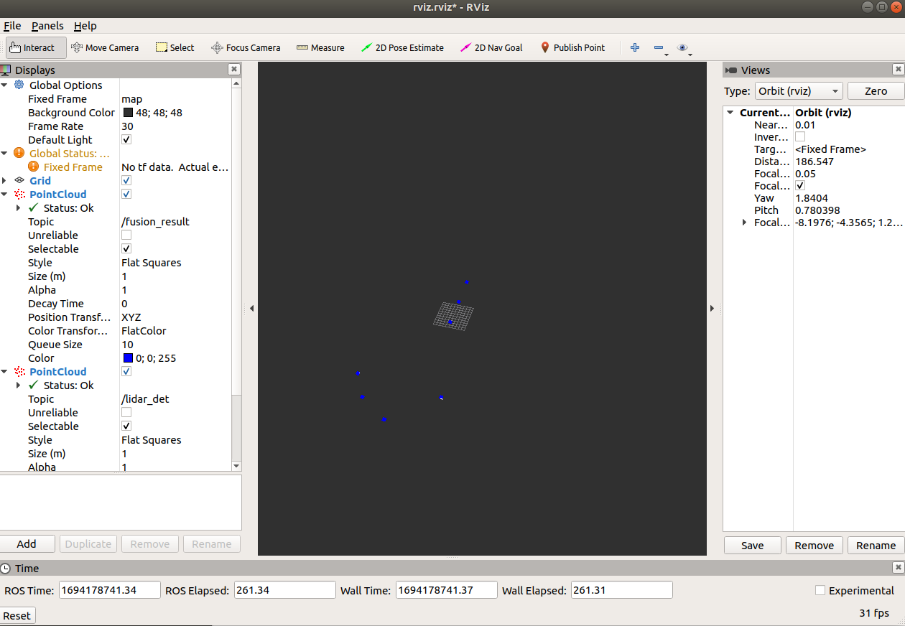

# [深蓝学院2022 - 多传感器融合作业](https://www.shenlanxueyuan.com/course/443)

## 第一次作业 - 传感器标定

#### 1. 内参标定

**数据集:** euroc 提供的标定数据集
- http://robotics.ethz.ch/~asl-datasets/ijrr_euroc_mav_dataset/calibration_datasets/cam_checkerboard/cam_checkerboard.zip
- http://robotics.ethz.ch/~asl-datasets/ijrr_euroc_mav_dataset/calibration_datasets/cam_april/cam_april.zip

**代码运行**
```
cd calib/camera_calibration
mkdir build 
cd build
cmake ..
make

## 棋盘格标定
./camera_calib -i /home/lifa/code/calib/cam_checkerboard/mav0/cam0/data

## 二维码标定
./camera_calib -i /home/lifa/code/calib/cam_april/mav0/cam0/data -a
```
**结果**
棋盘格

二维码


#### 2. Pose alignment

根据两条轨迹求外参。这个在现实中也是具有意义的, 通常 64 线以上的 LiDAR 在小范围内做绕 8 字运动, 通过纯激光 SLAM 算法可以得到一个比较好的轨迹,通过对齐轨迹是可以得到外参。

T1 * T2
- 左乘: R2 -> R1\*R2, t2 -> R2\*t2 + t1, 世界坐标系
- 右乘: R1 -> R1\*R2, t1 -> R1\*t2 + t1, 自身坐标系

**代码运行**
```
cd calib/pose_align

mkdir build 
cd build
cmake ..
make

./pose_align ../data/slam_poses.txt
```

**Alignment 结果**


**可视化**

```
cd scripts
python3 draw_trajectory.py
```


#### 3.LiDAR-LiDAR外参标定

**代码运行**
```
cd calib/lidar2lidar

mkdir build 
cd build
cmake ..
make

./lidar2lidar ../data/1_xyz.pcd ../data/2_xyz.pcd
```

**ICP结果**


**GICP结果**


**可视化**

source: 蓝, target: 红色, 预测: 绿色


## 第二次作业 - xxx

#### 要求
1. 实现fusion_ekf里的updateMotion
2. 根据自车和它车运动，将状态量对齐到观测量
3. 3d bounding box的iou 
4. 融合算法中状态量维护一个全局唯一的id
5. 运动信息和属性信息整合到一块进行融合

#### 完成情况
本库主要完成了1, 2, 4
- 关于3：一方面，之前在我其它库[PointPillars](https://github.com/zhulf0804/PointPillars)使用过，不想重复的做；另一方面，用距离代替IoU在此数据集已经表现不错了，不想在这个数据集再重新调试；
- 关于5：没有太多时间去实现了，就想了一下大致思路，除了把卡尔曼滤波中的状态量和矩阵等调整为9维外，还有一点注意的地方，也是我在看了优秀作业才意识到的。因为LiDAR和Camera的检测性能和结果是不同的，因此会出现3d box和2d box不同的匹配情况：
  - 对于状态量中的一个object, 如果存在观测帧的3d box和2d box都匹配到，这是很理想的，直接使用观测帧构成的9维观测值去更新状态量对应的object即可
  - 对于状态量中的一个object，如果仅存在观测帧的3d box匹配到，这时只需更新状态量中对应object中3d box信息和label即可
  - 对于状态量中的一个object，如果仅存在观测帧的2d box匹配到，这时只需更新状态量中对应object中2d box信息和label即可
  - 同时更新3d box和2d box，用到的矩阵是9 x 9的；如果只更新3d box或2d box，用到的矩阵是5 x 5的，这又怎么做到呢，可以通过在卡尔曼滤波中维护2套卡尔曼的矩阵即可。

#### 运行

```
mkdir catkin_ws
cd catkin_ws/
mkdir src
mv ../fusion-based-perception/ src/

catkin_make
source devel/setup.bash
```

或

```
mkdir build
cd build
cmake ..
make -j12

## 窗口1启动rviz
rviz -d ../config/rviz.rviz
## 窗口2运行融合程序
./devel/lib/kit_perception/sensor_fusion_node ../config/transform.yaml ../test_data/mutil_obj/localization ../test_data/mutil_obj/camera ../test_data/mutil_obj/lidar
```

#### 结果

- 不考虑自车朝向

- 考虑自车朝向


#### 其它

- 自车的position基本没有变 (decode_location.py)
    ```
    position_list_min [587056.4876794815, 4141610.5111312866, -1.2151983976364136]
    position_list_max [587056.4876804352, 4141610.5111351013, -1.215198040008545]
    orientation_list_min [0.0077273184433579445, 0.012947174720466137, -0.9915027022361755, -0.12921039760112762]
    orientation_list_max [0.007727358490228653, 0.012947200797498226, -0.9915026426315308, -0.12921036779880524]
    linear_velocity_list_min [3.300979733467102e-05, -4.7362642362713814e-05, -5.461668479256332e-06]
    linear_velocity_list_max [3.339909017086029e-05, -4.6805827878415585e-05, 6.628666596952826e-06]
    linear_acceleration_list_min [-0.18317593142088498, -0.23229949913037043, 9.805269792484172]
    linear_acceleration_list_max [-0.18311252366418992, -0.23225072615558082, 9.80577227802552]

    ```
- 疑问：obstacle框为什么要用世界坐标系表示呢 ?
