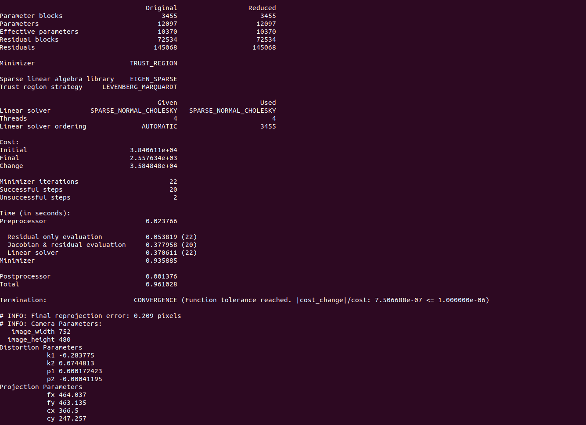
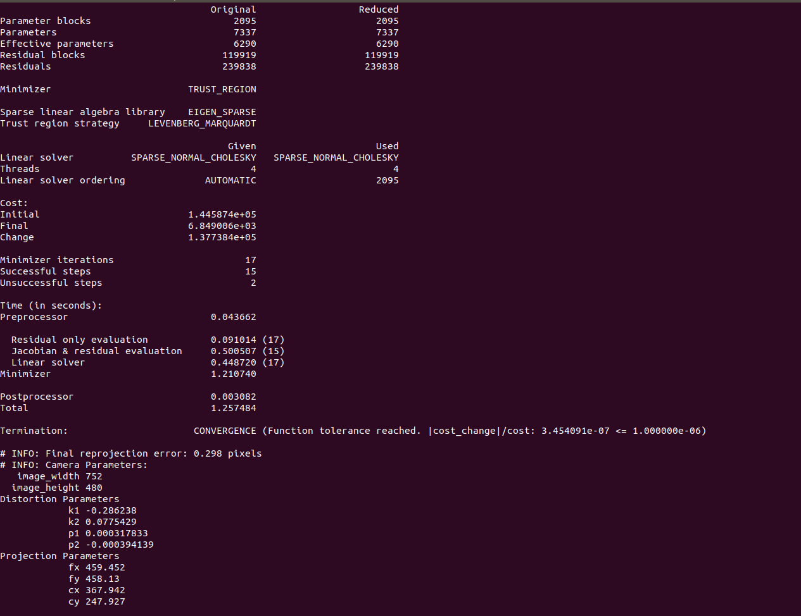
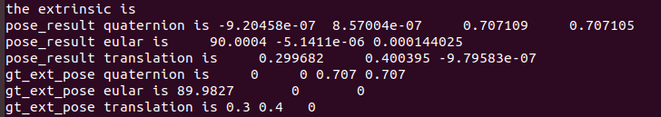
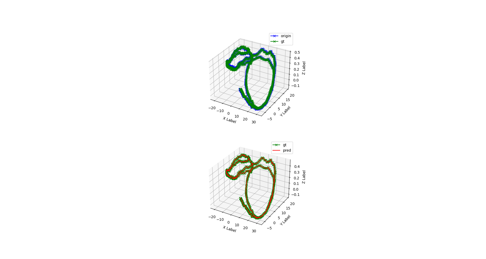
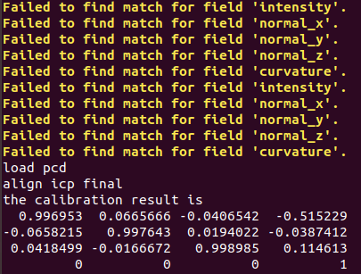
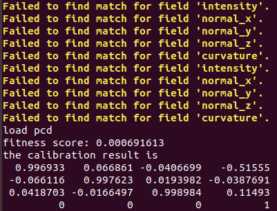
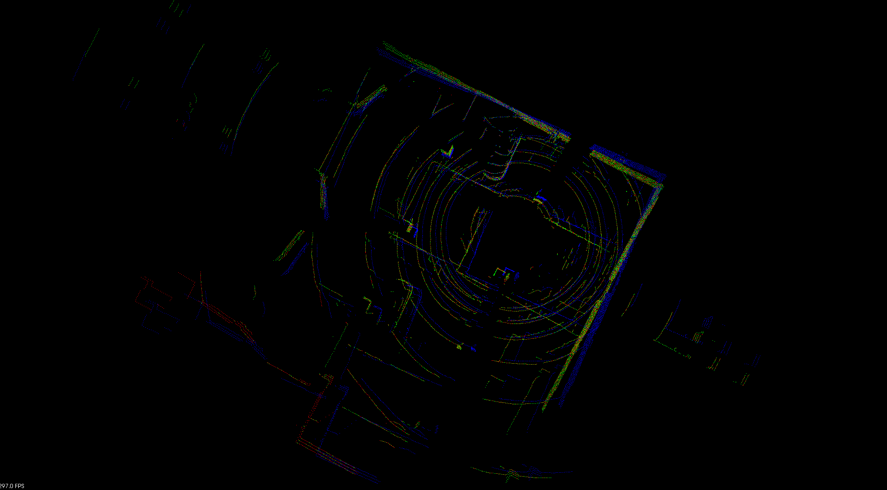

# 深蓝学院2022 - 多传感器融合作业

## 第一次作业 - 传感器标定

#### 1. 内参标定

**数据集:** euroc 提供的标定数据集
- http://robotics.ethz.ch/~asl-datasets/ijrr_euroc_mav_dataset/calibration_datasets/cam_checkerboard/cam_checkerboard.zip
- http://robotics.ethz.ch/~asl-datasets/ijrr_euroc_mav_dataset/calibration_datasets/cam_april/cam_april.zip

**代码运行**
```
cd calib/camera_calibration
mkdir build 
cd build
cmake ..
make

## 棋盘格标定
./camera_calib -i /home/lifa/code/calib/cam_checkerboard/mav0/cam0/data

## 二维码标定
./camera_calib -i /home/lifa/code/calib/cam_april/mav0/cam0/data -a
```
**结果**
棋盘格

二维码



#### 2. Pose alignment

根据两条轨迹求外参。这个在现实中也是具有意义的, 通常 64 线以上的 LiDAR 在小范围内做绕 8 字运动, 通过纯激光 SLAM 算法可以得到一个比较好的轨迹,通过对齐轨迹是可以得到外参。

T1 * T2
- 左乘: R2 -> R1\*R2, t2 -> R2\*t2 + t1, 世界坐标系
- 右乘: R1 -> R1\*R2, t1 -> R1\*t2 + t1, 自身坐标系

**代码运行**
```
cd calib/pose_align

mkdir build 
cd build
cmake ..
make

./pose_align ../data/slam_poses.txt
```

**Alignment 结果**


**可视化**

```
cd scripts
python3 draw_trajectory.py
```


#### 3.LiDAR-LiDAR外参标定

**代码运行**
```
cd calib/lidar2lidar

mkdir build 
cd build
cmake ..
make

./lidar2lidar ../data/1_xyz.pcd ../data/2_xyz.pcd
```

**ICP结果**



**GICP结果**


**可视化**

source: 蓝, target: 红色, 预测: 绿色


